## Part 1.
* Выкачиваем docker образ с ngnix с помощью команды docker pull ngnix 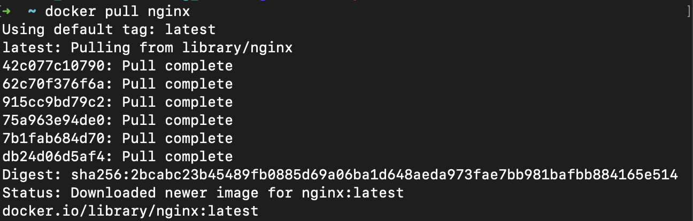
* Проверяем наличие docker образа с помощью команды docker images 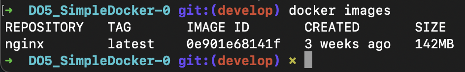
* Запускаем docker образ командой docker run -d 0e901e68141f (подставить IMAGE ID из предыдущего пункта) 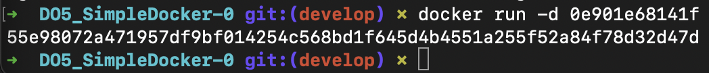
* Проверяем, что образ запустился командой docker ps 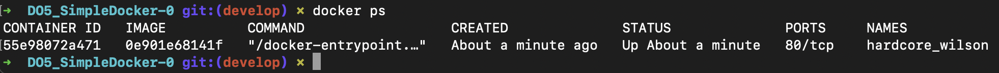
* Смотрим информацию о системе через docker inspect 55e98072a471 (подставить CONTAINER ID из предыдущего пункта)
    + Размер контейнера (в байтах) 
    + Список открытых портов 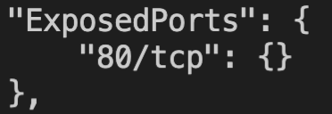
    + IP контейнера 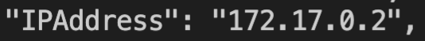
* Останавливаем docker образ командой docker stop 55e98072a471 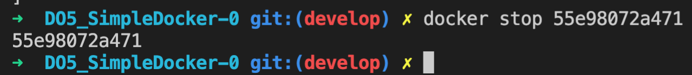
* Проверяем, что docker остановился командой docker ps 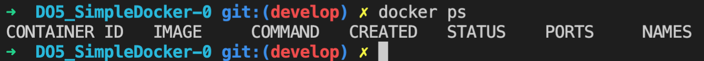
* Запускаем docker c замапленными портами 80 и 443 командой docker run -p 80:80 -p 443:443 -d nginx 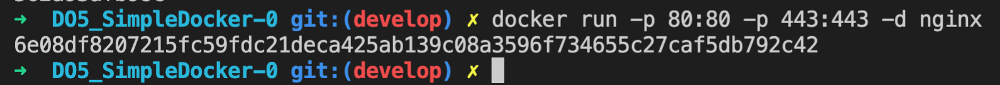
* Проверяем, что в браузере доступна стартовая страница nginx по адресу localhost:80 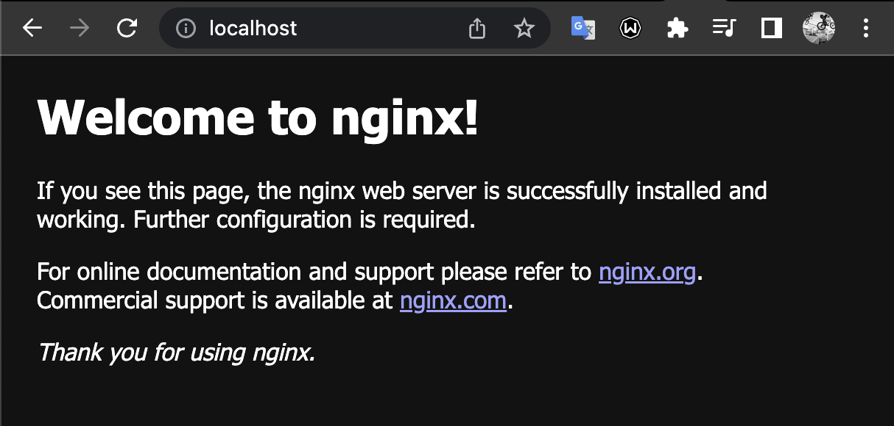
* Перезапускаем docker контейнер командой docker restart 6e08df820721 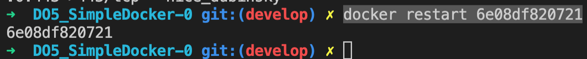
* Проверяем, что контейнер запустился командой docker ps 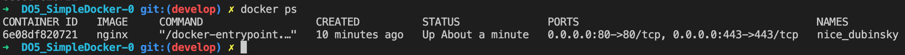

## Part 2.
* Читаем nginx.conf внутри docker образа командой docker exec -it 095f04c1a6f3 cat /etc/nginx/nginx.conf 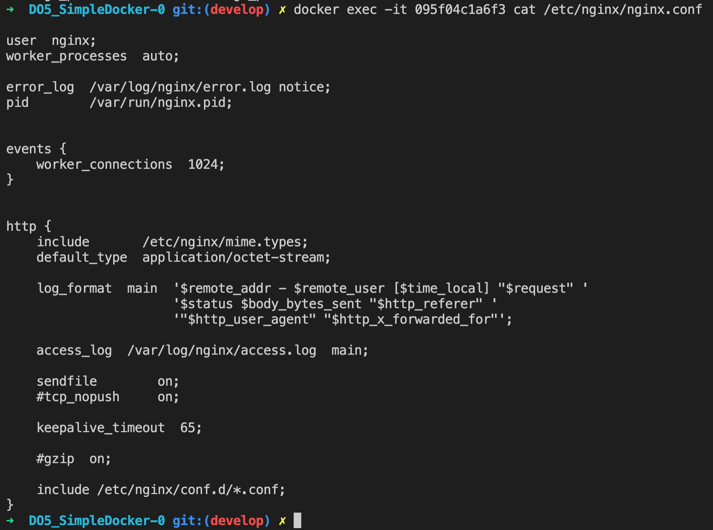
* Полезная инфа: http://nginx.org/ru/docs/beginners_guide.html
* Создаем на локальной машине файл nginx.conf и настраиваем в нем отдачу страницу статуса сервера nginx по пути /status 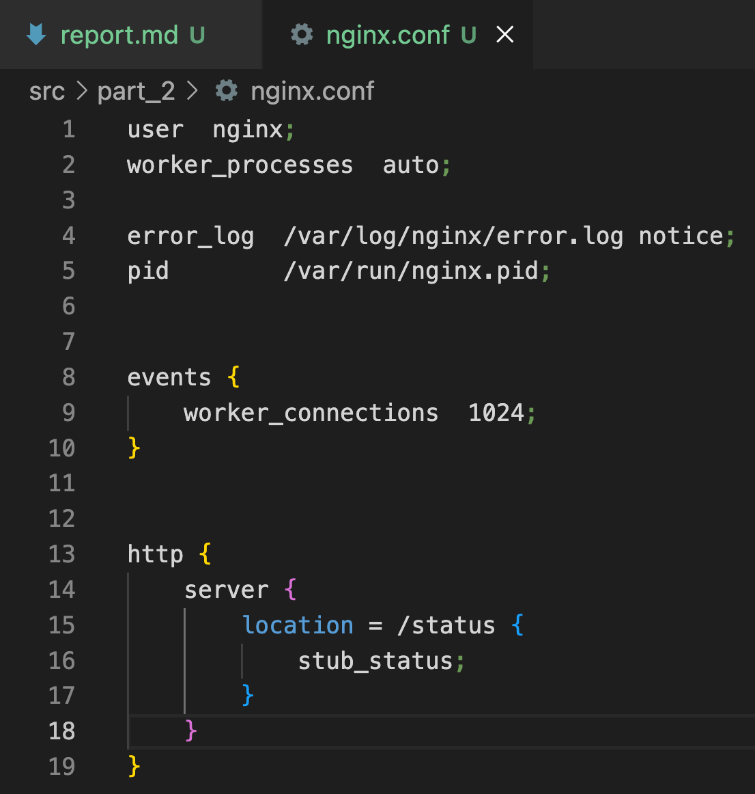
* Полезная инфа: https://900913.ru/tldr/common/en/docker-cp/
* Копируем созданный файл внутрь docker образа через команду docker cp nginx.conf 095f04c1a6f3:/etc/nginx 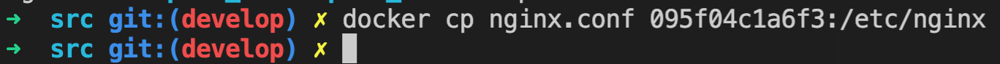
* Перезапускаем nginx внутри docker образа командой docker exec 095f04c1a6f3 nginx -s reload 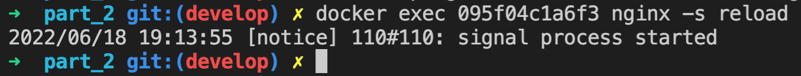
* Проверяем, что по адресу localhost:80/status отдается страничка со статусом сервера nginx 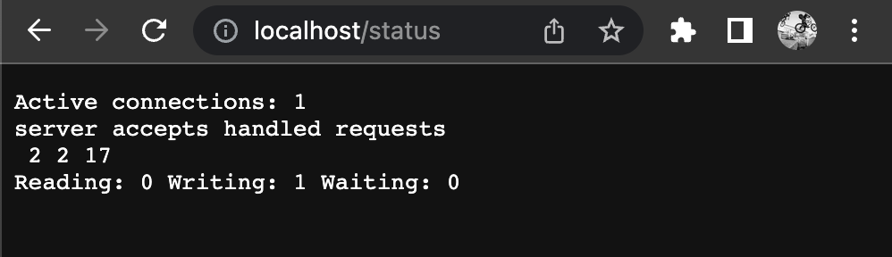
* Полезная инфа: https://www.youtube.com/watch?v=oUzHjXdq7gk
* Экспортируем контейнер в файл container.tar командой docker export -o container.tar 095f04c1a6f3 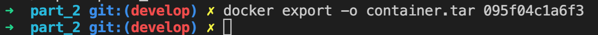
* Останавливаем контейнер командой docker stop 6e08df820721 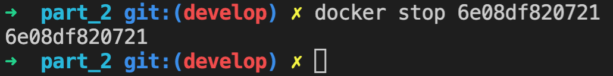
* Удаляем образ командой docker rmi nginx -f 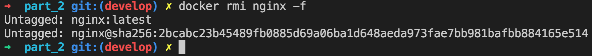
* Импортируем контейнер обратно командой docker import container.tar nginx 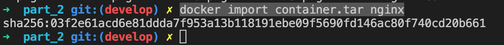
* Запускаем импортированный контейнер командой docker run -p 80:80 -p 443:443 -d -it nginx bash 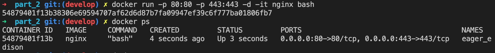
* Запускаем nginx командой docker exec -it 54879401f13b service nginx start 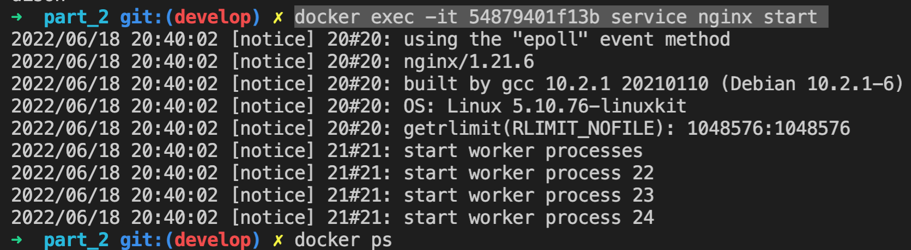
* Проверяем, что по адресу localhost:80/status отдается страничка со статусом сервера nginx 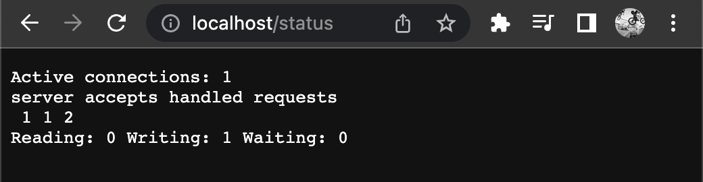

## Part 3.
* Запустить контейнер с портом 81 командой docker run -p 81:81 -d nginx
* Перейти в установленный контейнер командой docker exec -it beautiful_mccarthy bash
* Установить sudo apt-get install -y libfcgi-dev, sudo, apt-get install -y spawn-fcgi
* Перекинуть в контейнер файлы main.c, run.sh, nginx.conf
* Скомпилировать main.c командой gcc main.c -lpthread -lfcgi -o server
* Запустить бинарник командой spawn-fcgi -p 8080 -n ./server
* В другом терминале дать права скрипту командой chmod +x run.sh, запустить run.sh

## Part 4.
* Полезная инфа: https://www.youtube.com/watch?v=ZB8JBWriDVo
* Собираем Dockerfile командой docker build -t hello_world:1.0 .
* Запускаем контейнер командой docker run -p 80:81 -d hello_world:1.0

## Part 5.
* Устанавливаем Dockle через brew
* Выполняем команду dockle hello_world:1.0 и исправляем ошибки

## Part 6.
* Выполняем команду docker-compose up
